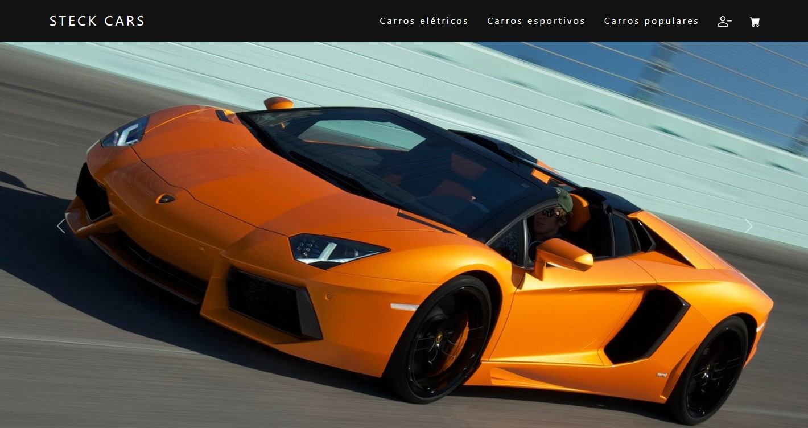

<h1> Steck Cars </h1>
 

<h1> Demonstração :</h1>

  

  

 

<h1>Sobre</h1>

 Projeto realizado como meio de aprendizado do Front-End e do Bootstrap.
Tentei testar algumas animações e expor o máximo de criatividade possível 😜.

 Caso queira, click no link e veja você mesmo: https://victorhdss6.github.io/Steck-Cars/ 
 

<ul>

 Projeto feito com as seguintes tecnologias: 

<li>✅ JavaScript</li>
<li>✅ HTML5</li>
<li>✅ CSS3</li>
<li>✅ Bootstrap</li>
</ul>

Feito por @Victorh2s 👨‍💻🔥
 
